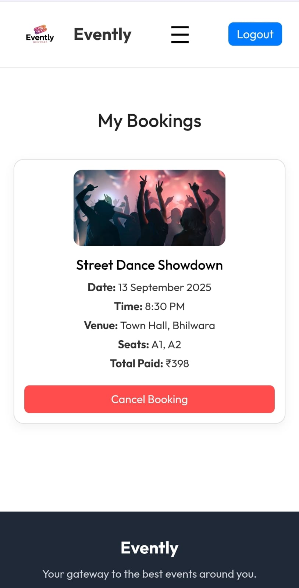

# 🎫 Evently - Ticket Booking Platform  

Evently is a full-stack web application for discovering and booking events online.  
It includes a **fully responsive UI** for all devices, a secure backend with payment integration,  
and a dedicated admin panel for managing events and bookings.  

🌍 **Live Demo**: [Evently Ticket Booking Website](https://evently-ticket-booking-website.vercel.app)  

---

## 📦 Frontend  

The frontend is built using **React (Vite)**.  
Features include:  
- Browse available events  
- View event details and seat availability  
- Book tickets using **Cashfree** payment gateway  
- Track bookings  
- **Responsive design** (mobile, tablet, desktop)  

---

## 🔧 Backend  

The backend is powered by **Node.js**, **Express**, and **MongoDB**.  
Responsibilities:  
- User authentication and authorization  
- Event and booking APIs  
- Payment session generation with **Cashfree**  
- Manage users, events, and bookings  

---

## 🛠️ Admin Panel  

The admin panel is a separate **React (Vite)** application.  
Admins can:  
- Create, update, and delete events  
- Monitor event bookings & user activity  
- Manage platform data through a dashboard  

---

## 🧑‍💻 Tech Stack  

- **Frontend**: Vite + React, Axios, React Router  
- **Backend**: Node.js, Express, MongoDB, Mongoose  
- **Admin**: Vite + React  
- **Payments**: Cashfree (Sandbox mode)  
- **Hosting**: Frontend → Vercel, Backend → Render  

---

## 📸 Screenshots

### 🖥️ Desktop View

### 📱 Mobile View

## 👤 Author  

Made by [Tejas Birla](https://github.com/TejasBirla) 🚀  
- Built a **fully responsive application**  
- Successfully **hosted frontend & backend**  

---
